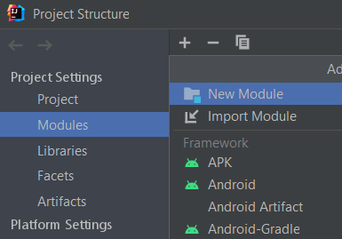
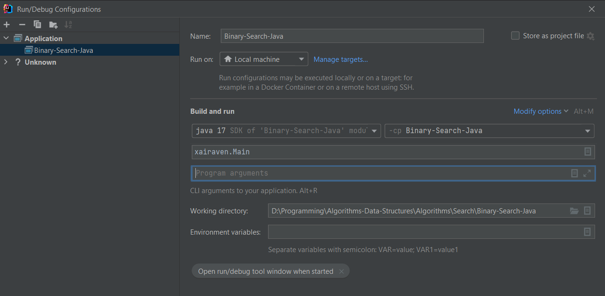

# Algorithms
Algorithms implemented by me.  

## Table of contents
### [Math](https://github.com/xairaven/Algorithms-Data-Structures/tree/main/Algorithms/Math)
- <a>Work in progress</a>
### [Search](https://github.com/xairaven/Algorithms-Data-Structures/tree/main/Algorithms/Search)
- <a href = "https://github.com/xairaven/Algorithms-Data-Structures/tree/main/Algorithms/Search/Binary-Search-Java">Binary search</a> | Java
### [Sorting](https://github.com/xairaven/Algorithms-Data-Structures/tree/main/Algorithms/Sorting)
- <a>Work in progress</a>

## How to compile project? (IntelliJ Idea)
### Step 1 (Adding module):
- File -> Project Structure -> Modules -> Import module -> *Select your module*  
</img>
### Step 2 (Run/Debug Configurations):
- Edit configurations -> Set your module and settings like this:  
</img>

## Resources
- I used library "stdlib.jar", licensed by GNU (GPL) v.3. 
- Authors: *Robert Sedgwick* and *Kevin Wayne* 
- Link: http://introcs.cs.princeton.edu/java/stdlib/stdlib-package.jar
- An archive that contains data files (largeW and e.t.c.) can be found at: http://algs4.cs.princeton.edu/code/algs4-data.zip
