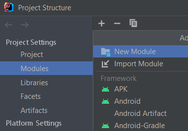
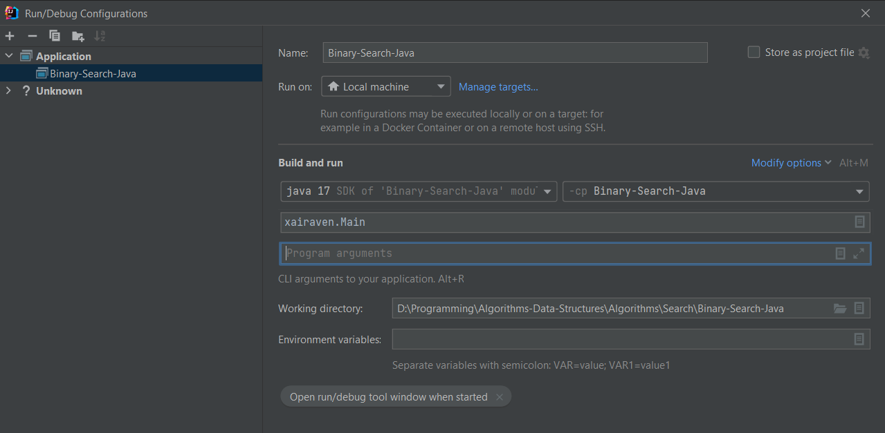

# Algorithms & Data Structures | Java
In this repo you'll see some algorithms and data structures implemented by me on Java.

---

**THIS REPOSITORY IS NO LONGER MAINTAINED.**

**No updates will be provided as I've moved away from Java Development.**

---

## Algorithms
### Search
- [Binary search](./src/ua/xairaven/main/Search/BinarySearch.java) | Java
### Math
- [Math tricks](./src/ua/xairaven/main/Maths/) | Java
### Graphs
- [Graph](./src/ua/xairaven/main/Graphs/) | Java
### Sorting
- [Bubble sort](./src/ua/xairaven/main/Sorting/BubbleSort.java) | Java
- [Cocktail Shaker sort](./src/ua/xairaven/main/Sorting/CocktailShakerSort.java) | Java
- [Selection sort](./src/ua/xairaven/main/Sorting/SelectionSort.java) | Java
- [Insertion sort](./src/ua/xairaven/main/Sorting/SelectionSort.java) | Java
- [Shell sort](./src/ua/xairaven/main/Sorting/ShellSort.java) | Java
- [Merge sort](./src/ua/xairaven/main/Sorting/MergeSort.java) | Java
- [Quicksort](./src/ua/xairaven/main/Sorting/Quicksort.java) | Java

## Data Structures
### Lists:
- [Bag](./src/ua/xairaven/main/DataStructures/Bags/Bag.java) | Java
- [Deque](./src/ua/xairaven/main/DataStructures/Queues/Deque.java) | Java
- [Queue](./src/ua/xairaven/main/DataStructures/Queues/Queue.java) | Java
- [Stack](./src/ua/xairaven/main/DataStructures/Stacks/Stack.java) | Java
### Symbol Tables (Trees, Hash-maps, e.t.c):
- [BST (Binary Search Tree)](./src/ua/xairaven/main/DataStructures/SymbolTables/BinarySearchST.java) | Java
- [Binary Search Array ST](./src/ua/xairaven/main/DataStructures/SymbolTables/BST.java) | Java
- [Red-Black BST](./src/ua/xairaven/main/DataStructures/SymbolTables/RedBlackBST.java) | Java
- [Sequential Search ST](./src/ua/xairaven/main/DataStructures/SymbolTables/SequentialSearchST.java) | Java
### Union Find:
- [Quick Union](./src/ua/xairaven/main/DataStructures/UnionFind/QuickUnion.java) | Java
- [Union Find](./src/ua/xairaven/main/DataStructures/UnionFind/UnionFind.java) | Java
- [Weighted Quick Union](./src/ua/xairaven/main/DataStructures/UnionFind/WeightedQuickUnion.java) | Java

# How to start?
## Installing
- Clone repository
```
git clone github.com/xairaven/JavaAlgorithms
```
### Environment
  - Install Java IDE (IntelliJ Idea preferably) and JDK 17.0
## How to compile project? (IntelliJ Idea)
### Step 1 (Adding module):
- File -> Project Structure -> Modules -> Import module -> *Select your module*<br><br>
  </img>
### Step 2 (Run/Debug Configurations):
- Edit configurations -> Set your module and settings like this:<br><br>
  </img>

## Resources
- I used library "algs4.jar", licensed by GNU (GPL) v.3.<br>
- Authors: *Robert Sedgwick* and *Kevin Wayne*<br>
- Link: https://github.com/kevin-wayne/algs4
- An archive that contains data files (largeW and e.t.c.) can be found at: http://algs4.cs.princeton.edu/code/algs4-data.zip
